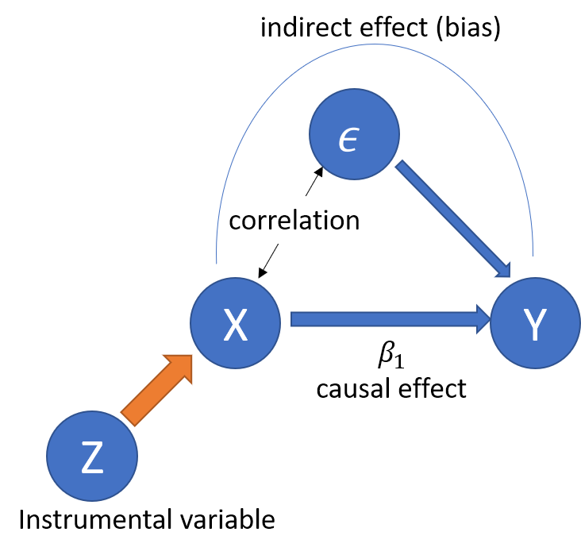

# Background

**GOALS OF TUTORIAL**: 

1. Understand OLS assumptions and the violations of these assumptions
2. Understand what Instrumental variables are, and why we use IVs
3. Learn how to run an IV regression in R

**Sources**:

- Cigarette dataset (https://github.com/vincentarelbundock/Rdatasets/blob/master/csv/Ecdat/Cigarette.csv)

# Setup

Let's set up a new environment and load our libraries in one place.

```{r}
rm( list = ls(all.names = TRUE) )

## Installing libraries

if(!require(ggplot2)) install.packages("ggplot2")
#if (!requireNamespace("ggplot2", quietly = TRUE)) {install.packages("ggplot2")}
if(!require(car)) install.packages("car")
#if (!requireNamespace("car", quietly = TRUE)) {install.packages("car")}
if(!require(lmtest)) install.packages("lmtest")
if(!require(sandwich)) install.packages("sandwich")
if(!require(AER)) install.packages("AER")
if(!require(ivreg)) install.packages("ivreg") # new versions have ivreg function in AER
if(!require(dplyr)) install.packages("dplyr") 


## Loading libraries
library(ggplot2)
library(car)
library(lmtest)
library(sandwich)
library(AER)
library(ivreg)
library(dplyr)

```

Setting up our working directory

```{r}
# Automatically (based on location of this script)
working_directory <- dirname(rstudioapi::getActiveDocumentContext()$path)

# , or manually...
# setwd("C:\\Users\\lhoxhaj\\OneDrive - Imperial College London\\Desktop\\TA\\Shuang\\Tutorials\\Lir\\tutorial_1") # set wd

```


# 1. OLS assumptions (and violations)

## Motivation

We mentioned that when we try to use a statistical method to *predict* and *infer* a relationship between a dependent and independent variable, we make several assumptions about the sample data we are using and the functional form of the relationship.

## Assumptions

For the OLS method, we assume the following:

1. **Linear relationship**
2. **Linear independence of regressors (no multicollinearity)**
3. **Homoscedasticity of error term**
4. **Normal distribution of error term**
5. **Zero mean of error term**
6. **Exogeneity (no endogeneity)**


The assumptions (some stricter than others) help define OLS and give us estimates of $\beta$ that are:

- **consistent**: estimator is closer to the truth as sample size increases: $\hat{\beta} \rightarrow \beta \text{ as } n \rightarrow \infty$; 
- and **unbiased**: expected value of estimator is equal to the true value of the parameter $E[\hat{\beta}] = \beta$.


### 1. Linear Relationship

We assume that the relationship between our dependent and independent variables is linear. This can be expressed using matrix notation:

$$\Large E[Y|X]=X\beta$$

, or the simple linear regression model:

$$\Large y_i = \beta_0 + \beta_1x_i + u_i$$
where:

-   index $i$ covers all the observations - $i = 1,...,n$
-   $y_i$ is the **dependent** variable (and $Y$ is its matrix), also known as **regressand** or **left-side**
-   $x_i$ is the **independent** variable (and $X$ is its matrix), also known as **regressor** or **right-side**
-   $y = \beta_0 + \beta_1x$ is the **regression line**
-   $\beta_0$ is the regression line **intercept**
-   $\beta_1$ is the regression line **slope** (sometimes **coefficient**)
-   $u_i$ is the **error term** 

$\beta_0$ and $\beta_1$ are unknown and are (most cases) anything but linear, since relationships between variables are complex and cannot be simply explained through a linear equation.

$$\Large \hat{y_i} = \hat{\beta_0} + \hat{\beta_1} x_i$$

, where the error is the difference between predicted outcome and the true outcome.


### 2. Linear independence of regressors (no multicollinearity)

Independent variables should be independent from each other, and there no linear relationship between two or more of the independent variables should exist (or at least a very weak one). This ensures that each independent variable contributes unique information to the model. **Perfect multicollinearity** (when variables are linearly dependent and vary together almost always) leads to problems with estimation, as the model cannot uniquely estimate the coefficients, which can make it difficult to interpret the effects of individual variables.

$$\Large corr[X_1,X_2] \neq 1$$

### 3. Homoscedasticity of error term

The error term should have constant variance for all values of the independent variables. This means that the spread of residuals is the same across all levels of the independent variables. If the variance of the errors depends on the level of the independent variables (heteroscedasticity), the OLS estimates can still be unbiased but will no longer be efficient, and hypothesis tests can be misleading. There could very well be something that is causing heteroscedastic (not constant) variance in the error term, some other factor that we have not accounted for in the model.

Here, we may write the variance of the error term as some constant $\sigma^2$ ($\sigma$ is standard error), which is the same no matter the values of $X$.

$$\Large Var[u|X] = \sigma^2$$

```{r}
# Step 1: Using cigarettes dataset, we have variables price of pack of cigarette and quantity of packs sold
cigarettes <- read.csv("cigarettes.csv")
# Step 2: Estimating relationship between packs (quantity) and price (per pack)
model <- lm(packs ~ price, data = cigarettes)
```

In a homoscedastic scenario, the spread of the residuals should be roughly constant across the range of fitted values. If you see a pattern or a funnel shape in the plot, it might suggest homoscedasticity (constant variance), whereas if variance seems to be changing (sometimes points are closer to each other, and at other times they are further away or more varied) then that will raise heteroscedasticity concerns.

```{r}
# Step 3: Showing the values of fitted data (on x-axis) and the residuals (on y-axis)
residuals_plot <- ggplot(data = cigarettes, aes(x = fitted(model), y = resid(model))) +
  geom_point() +
  geom_smooth(method = "loess", se = FALSE, linetype = "dashed") +
  labs(x = "Fitted Values", y = "Residuals") +
  ggtitle("Residuals vs Fitted Values") +
  theme_minimal()

print(residuals_plot)
```

```{r}
# Step 4: Perform Breusch-Pagan test to check for homoscedasticity
bp_test <- ncvTest(model)
print(bp_test)
```

$$
\begin{aligned}
\Large H_0: \text{error term is homoscedastic }, Var[u|X] = \sigma^2\\
\Large H_1: \text{error term is heteroscedastic }, Var[u|X] \neq \sigma^2
\end{aligned}
$$

Conclusion: not enough evidence to reject null hypothesis, hence distribution of error term is homoscedastic.

### 4. Normal distribution of error term

The error term should be normally distributed. This assumption is mainly important for making valid inferences about the regression coefficients, particularly for hypothesis testing and constructing confidence intervals.

```{r}
# This is a random dataset generated by R that has a normal distribution
random_normal_data <- data.frame(values = rnorm(1000))  # 1000 random values from a normal distribution

# Create a histogram using random data
normal_plot <- ggplot(random_normal_data, aes(x = values)) + 
  geom_histogram(fill = "blue", color = "black") +
  labs(title = "Histogram of Values", x = "Values", y = "Frequency")

# Create a histogram using residuals of our model
model_residuals <- resid(model)
resid_plot <- ggplot(cigarettes, aes(x = model_residuals)) + 
  geom_histogram(fill = "blue", color = "black") +
  labs(title = "Histogram of residuals", x = "Values", y = "Frequency")

print(normal_plot)
print(resid_plot)
```
We can use the Shapiro-Wilk test for normality to know if the sample data is normaly distributed, where:


$$
\begin{aligned}
\Large H_0: \text{sample data has normal distribution}\\
\Large H_1: \text{sample data does not have normal distribution}
\end{aligned}
$$

```{r}
# Estimating Shapiro-Wilk test for normality
print(shapiro.test(random_normal_data$values)) # normal distributed data (we know for sure this is normal)
print(shapiro.test(model_residuals)) # residuals from ciggaretes data (we do not know for sure whether these are normally distributed)
```

Based on the p-values, we have enough evidence to reject the null hypothesis of this test, concluding that the residuals estimated from the regression model using cigarettes.csv is not normally distributed.

### 5. Zero mean of errors 

This implies that the error term should be completely *random*, meaning it's mean is zero $E[u]=0$,

```{r}
# Calculating mean of residuals
residual_mean <- mean(model_residuals)
print(residual_mean)
```


### 6. Exogeneity (no endogeneity)

The error term should not be correlated with any of the independent variables $E[u|X]=0$. In other words, the independent variables should be determined outside the model (hence, the word *'exogenous'*, related to external) and not be influenced by the errors. If the regressors are correlated with the error term (*endogeneity*), the OLS estimates will be biased and inconsistent, making them unreliable for causal inference.

Endogeneity may be cause by many things, such as:

- **Selection problem**: This issue occurs when there is a non-random selection of observations, leading to a sample that is not representative of the population. True model could be $Y=X\beta+u$, but instead we estimate $Y=X\beta+v$. This biased selection process may cause that the observations of X may be correlated to the error term. 
- **Simultaneity bias (simultaneous causality)**: This occurs when two or more variables in the model are determined simultaneously by each other. This relationship may imply that $X$ is influenced by the dependent variable $y$. Famous example: Do good institutions cause economic development, or countries have good institutions because of their developed economy? [AJR (2001)](https://www.aeaweb.org/articles?id=10.1257/aer.91.5.1369) won a Noble Prize and gave an answer to this question...
- **Omitted variable bias**: This is one of the most common causes of endogeneity. True model might be $Y=X_1\beta_1+X_2\beta_2+u$, but we estimate $Y=X_1\beta_1+v$, where $v=X_2\beta_2+u$. The omitted variables $X_2$ could be correlated with the included variables $X_1$ and with the error term $u$, resulting in a correlation between the explanatory variables and the error term. Excluding $X_2$ when $\beta_2 \neq 0$, meaning it affects $y$, may also be an issue as that variation may be represented in $\beta_1$, thus we have a $\beta_1$ that is over or underrepresented.
- **Measurement error (Observational error)**: This happens when the explanatory variables are measured with error, which causes a difference between a measured value of a quantity and its unknown true value. Such errors are inherent in the measurement process. True model could be $Y=X^*\beta+u$, but observed model is $y=X\beta+v$, where $X^*=X+\epsilon$ ($\epsilon$ is some error that captures the difference between true $X^*$ variable data and the biased sample data we collect $X$), and therefore $v=-\beta\epsilon+u$.


# 2. Instrumental variables (IVs)

## Motivation

We learned about regression models and the problems of **estimation bias** experienced from omitted variables, measurement errors, and simultaneous causality (where $X$ causes $Y$ and vice versa). We also learned that this estimation bias can be corrected somewhat by adding omitted variables into the regression model to mitigate the risk of a biased estimate of any causal effects.

But what do we do when we can't include omitted variables? What if the omitted variables are unavailable, or cannot be measured? Multiple regression cannot solve this problem...

Enter **IV Regression**, a technique for uncovering hidden correlations between our dependent and independent variables through the use of an instrumental variable. Instrumental variables are best described as a third variable (let's call it $Z$), which is associated with our independent variable $X$ in some way. $Z$ is also associated with dependent variable $Y$, but **only through** $Y$'s direct association with $X$.

For example, suppose we want to investigate and estimate the causal effect of smoking ($X$) on general health ($Y$). Simply correlating general health and smoking does not imply that smoking causes poor health because other factors such as depression may affect both. Therefore, we need an IV to uncover the relationship between $Y$ and $X$, as it would be difficult to conduct controlled experiments in smoking in the general population. A possible IV could be using the tax rate on tobacco as an instrument for smoking. Why? Because this tax can only be correlated with general health through its effects on smoking (so, correlated with smoking but not directly with general health). If a relationship between tobacco tax and health is discovered, this provides evidence that smoking causes changes in health.

We use an IV to bridge this gap by essentially splitting the independent variable $X$ in two parts: one that might be correlated with the error term ($u$), and a part that probably is not. Isolating the latter part allows us to estimate $\beta$ coefficients.




What we want is for IV to be:

- correlated with endogenous variable $X$
- uncorrelated with error term (so, the IV itself is exogenous)
- only impact outcome $y$ through $X$

How many IVs we need? At least as many instruments as endogenous regressors

- *just identified*: $\text{number of predictors} = \text{number of instruments}$
- *over identified*: $\text{number of predictors} < \text{number of instruments}$

Conditions for a **valid** IV:

1. **Relevance:** instrument $Z$ is relevant when it is correlated with and explain the variation in $X$. A weak instrument is one that is not correlated with $X$ and may give us biased results.
2. **Exogeneity:** instrument $Z$ is exogenous when it not correlated with error $u$ 

## Two-Stage Least Squares (2SLS) Estimation

This is our regression model, what we want to estimate:

$$\Large Y = \beta_0 + \beta_1 X_1 + \beta_2 X_2 + u$$
where $X_1$ is the endogenous variable.

We estimate all this using a two-stage procedure:

1. **Stage 1:** Regress $X$ on $Z$ using OLS

Due to IV regression splitting the independent variable $X$ into two parts, we need to also split the process of performing the regression into two parts.

Firstly, we decompose the variation in $X$ into two partitions:

-   A "problem-free" $X$ partition that is explained by instrumental variable $Z$
-   A "problematic" $X$ partition that is correlated with error term

Secondly, we use the "problem-free" partition of $X$ to estimate $\beta_1$.

The first stage of the model takes the form:

$$
\Large
X_i = \pi_0 + \pi_1 Z_i + \nu_i
$$

Where $\pi_0 + \pi_1 Z_1$ is the "problem-free" partition of $X_i$, and $\nu_i$ is the "problematic" partition of $X_i$.

We can use OLS to obtain estimates $\hat{\pi_0}$ and $\hat{\pi_1}$ and subsequently predicted values $\hat{X_i}$ for $i=1,...,n$, if our instrumental variable $Z$ is valid. The $\hat{X_i}$ are problem-free because $\hat{X}$ is exogenous in a regression of $Y$ on $\hat{X}$, which is done in the second stage.

2. **Stage 2:** Regress $Y$ on fitted values $\hat{X}$ using OLS.

After getting fitted values: $\hat{X}_1 = \hat{\pi}_0 + \hat{\pi}_1 Z_i$, we apply OLS on the following:

$$\Large Y = \beta_0 + \beta_1 \hat{X}_1 + \beta_2 X_2 + u$$

Now, we have an unbiased estimator $\hat{\beta}$

### Application using data

Back to our example of the effects of smoking on general health, let's test our previously stated conjecture regarding tobacco taxes. Unlike the conjecture, we do not have data for general health of the population, however we can proxy this into quantity of demand for cigarettes. 

More formally the question we are asking is how much do we have to increase tobacco taxes by to achieve a certain reduction in smoking. In economics we refer to this as **elasticity**, or the percentage change in one variable in response to a percentage change in another. More specifically, we are dealing with a price elasticity for the demand of cigarettes which is unknown and must be estimated. 

We will use IV, because we cannot use OLS regression in this scenario due to simultaneous causality between supply and demand of cigarettes.

Firstly, load the data into R with the **cigarettes.csv** file provided (don't forget to set your working directory!)

```{r}
cigarettes <- read.csv("cigarettes.csv")
```

Now, let's get a summary of our data:

```{r}
summary(cigarettes)
```

We can see some large variances in variables relating to cigarette price and tax, alongside income and population.

#### Model and Estimation

In this exercise, we are interested in estimating $\beta_1$ in the model:

$$
\Large
\ln (Q^{cigarettes}_i) = \beta_0 + \beta_1 \ln(P^{cigarettes}_i) + u_i
$$

Where $Q^{cigarettes}_i$ ($Y$) is the quantity of cigarette packs sold per capita, and $P^{cigarettes}_i$ ($X$) is the after-tax real price per cigarette pack in state $i$.

$tax$ is the average state, federal, and average local excise taxes for fiscal year, and $taxs$ is the average excise taxes for fiscal year, including sales taxes. $sales\_tax$ is the difference between the two, which we will use as an IV to estimate endogenous variable $P^{cigarettes}_i$, as it is included in after tax average price per pack. We can also presume $sales\_tax$ to be exogenous as sales tax does not directly influence quantity of packs sold, but influences it indirectly through the price.

We will have to compute $sales\_tax$ as it is not included in the dataset. Additionally, for this analysis we are only interested in the data for the year 1995. Finally, we must compute real prices by dividing prices and taxes by the $cpi$ figure provided.

1. Create subset of data for 1995

```{r}
cigs_1995 <- subset(cigarettes, year == "1995")
# or, use:
cigs_1995 <- cigarettes %>%
  filter(year == "1995")
```

2. Compute real per capita prices
```{r}
cigs_1995$real_price <- with(cigs_1995, price / cpi)
# or, use:
cigs_1995$real_price <- cigs_1995$price / cigs_1995$cpi
```

3. Compute sales tax
```{r}
cigs_1995$sales_tax <- with(cigs_1995, (taxs - tax) / cpi)
```

Next, we do a correlation check between $sales\_tax$ and nominal $real\_price$, and between the former and $packs$:

```{r}
print(cor(cigs_1995$sales_tax, cigs_1995$real_price))
print(cor(cigs_1995$sales_tax, cigs_1995$packs))
```

We have a semi-strong positive correlation between $sales\_tax$ and nominal $real\_price$, indicating that taxes increase with prices.

Also, let's plot a scatter of the two variables to see visually if there are any relationships:

```{r}
ggplot(cigs_1995, aes(x = real_price, y = packs)) +
  geom_point(color = "darkgreen", alpha = 0.7) +  # Scatter points
  geom_smooth(method = "lm", color = "red", se = FALSE) +  # Add regression line
  labs(
    title = "Scatterplot: Real price of cigarettes and quantity consumed",  # Title
    x = "CPI-adjusted price of cigarettes",  # X-axis label
    y = "Number of cigarette packs consumed"  # Y-axis label
  ) +
  theme_minimal()  # Clean minimal theme

ggplot(cigs_1995, aes(x = log(real_price), y = log(packs))) +
  geom_point(color = "green", alpha = 0.7) +  # Scatter points
  geom_smooth(method = "lm", color = "red", se = FALSE) +  # Add regression line
  labs(
    title = "Scatterplot: Real price of cigarettes and quantity consumed",  # Title
    x = "Logged CPI-adjusted price of cigarettes",  # X-axis label
    y = "Logged Number of cigarette packs consumed"  # Y-axis label
  ) +
  theme_minimal()  # Clean minimal theme

```

We can see a clear negative relationship between the the price of cigarettes and quantity sold. OLS helps estimate the model $\ln (Q^{cigarettes}_i) = \beta_0 + \beta_1 \ln(P^{cigarettes}_i) + u_i$. We see that the estimate of the coefficient that describes the impact of $real\_price$ on $packs$ is **-1.21**, meaning that for 1% increase in price, we have a 1.21 in quantity. We will show that this coefficient is biased when accounting for an instrumental variable.

```{r}
# perform first stage
cigs_ols <- lm(log(packs) ~ log(real_price), data = cigs_1995)
summary(cigs_ols)
```


#### Stage 1


Step one of our regression is to split the "problematic" and "problem-free" portions:

$$
\Large
\ln (P^{cigarettes}_i) = \pi_0 + \pi_1 sales\_tax_i + \nu_i
$$

We will estimate this model using lm():

```{r, warning=FALSE}
# perform first stage
cigs_stage_1 <- lm(log(real_price) ~ sales_tax, data = cigs_1995)

# coefficient test (t-test)
summary(cigs_stage_1)
```

Substituting figures into our regression model gives us:

$$
\Large
\widehat{\ln (P^{cigarettes}_i)} = 4.62 + 0.031 sales\_tax_i
$$

This is how our prediction looks like graphically

```{r}
ggplot(cigs_1995, aes(x = sales_tax, y = real_price)) +
  geom_point(color = "orange", alpha = 0.7) +  # Scatter points
  geom_smooth(method = "lm", color = "red", se = FALSE) +  # Add regression line
  labs(
    title = "Scatterplot: Sales tax on cigarettes and real price of cigarettes",  # Title
    x = "Sales tax",  # X-axis label
    y = "CPI-adjusted price of cigarettes"  # Y-axis label
  ) +
  theme_minimal()  # Clean minimal theme
```

Our model predicts the relationship between $sales\_tax$ and $real\_price$ to be positive, which is true according to the laws of supply-demand. A higher sales tax will force producer to increase prices. But how much of the observed variation in $(P^{cigarettes})$ can be explained by the IV $sales\_tax$?

We can call the $R^2$ of the regression to find an answer:

```{r}
summary(cigs_stage_1)$r.squared
```

47% of the variance in post-tax $real\_price$ appears to be explained by $sales\_tax$ across different states.

We can test the relevance of the IV using the Wald test. From $\ln (P^{cigarettes}_i) = \pi_0 + \pi_1 sales\_tax_i + \nu_i$, we test for the following hypothesis:

$$
\begin{aligned}
\Large H_0: cov[Z,X] = 0, or, \pi_1 = 0 \\
\Large H_1: cov[Z,X] \neq 0, or, \pi_1 \neq 0
\end{aligned}
$$

Notice that this is the same p-value as the one in the OLS regression above. The low p-value below 1% leads us to assume that we do not have enough evidence to reject the null hypothesis that $Z$ ($sales\_tax$) has no impact on $X$ ($real\_price$). Therefore, we believe that $sales\_tax$ does have a significant positive impact on $real\_price$ at 1% level of significance. 

```{r}
first_stage_ftest <- waldtest(cigs_stage_1, .~1)
print(first_stage_ftest)
```


#### Stage 2

Before we begin step two of our regression, we need to save the estimator $\widehat{\ln (P^{cigarettes}_i)}$ from step one:

```{r}
pred_cigs_stage_1 <- cigs_stage_1$fitted.values
```

These values are the ones estimated by the OLS, seen in the red fitted line in the scatterplot above in the first stage regression.

Now we run the second step, a regression of $\ln (Q^{cigarettes}_i)$ on $\widehat{\ln (P^{cigarettes}_i)}$ to find $\hat{\beta_0}^{TSLS}$ and $\hat{\beta_1}^{TSLS}$

```{r}
# perform second stage
cigs_stage_2 <- lm(log(cigs_1995$packs) ~ pred_cigs_stage_1)

# coefficient test (t-test)
summary(cigs_stage_2)
```

Substituting into our step two model gives:

$$
\Large
\widehat{\ln (Q^{cigarettes}_i)} = 9.72 -1.08 \widehat{\ln (P^{cigarettes}_i)}
$$

We can see that the "problem-free" 2SLS estimators for $\beta_1$ suggest an increase in cigarette prices by 1% (one unit) reduces consumption by 1.08 percentage points - fairly elastic. The main idea here was to have a more accurate $\hat{\beta_1}$. If you remember, our initial OLS said $\hat{\beta_1}$ is 1.21, whereas the less biased two-stage estimator $\hat{\beta}^{2SLS}$ says that it is in fact 1.08. The impact of price on quantity is much lower! This is because the initial regression included external variation of other factors (e.g., $sales\_tax$) in that coefficient estimate. In severe cases, this difference in estimates (i.e., bias) can be even larger.

However, similar to linear regression, IV regression can still be biased due to omitted variables and other underlying assumptions of the data!


### A Coding Shortcut for IV Regressions

As a climate change scientist/ESG analyst/academic researcher, your time is precious. In many instances R has in-built capabilities to perform many tasks, and when they aren't built in they can be sourced via a library! The AER library contains an **ivreg()** function to perform IV regressions without having to split into two parts.

Then, call ivreg() using the same $X$, $Y$, and $Z$ variables as before:

```{r}
# perform IV regression with ivreg()
cigs_ivreg <- ivreg(log(packs) ~ log(real_price) | sales_tax, data = cigs_1995)
summary(cigs_ivreg)
```

The syntax for ivreg() is $Y$ (log of packs) regressed on (\~) $X$ (log of real price) given (\|) $Z$ sales tax. Much faster!


Compare to OLS estimate (without IV)

```{r}
cigs_ols <- lm(log(packs) ~ log(real_price), data = cigs_1995)
summary(cigs_ols)
```

